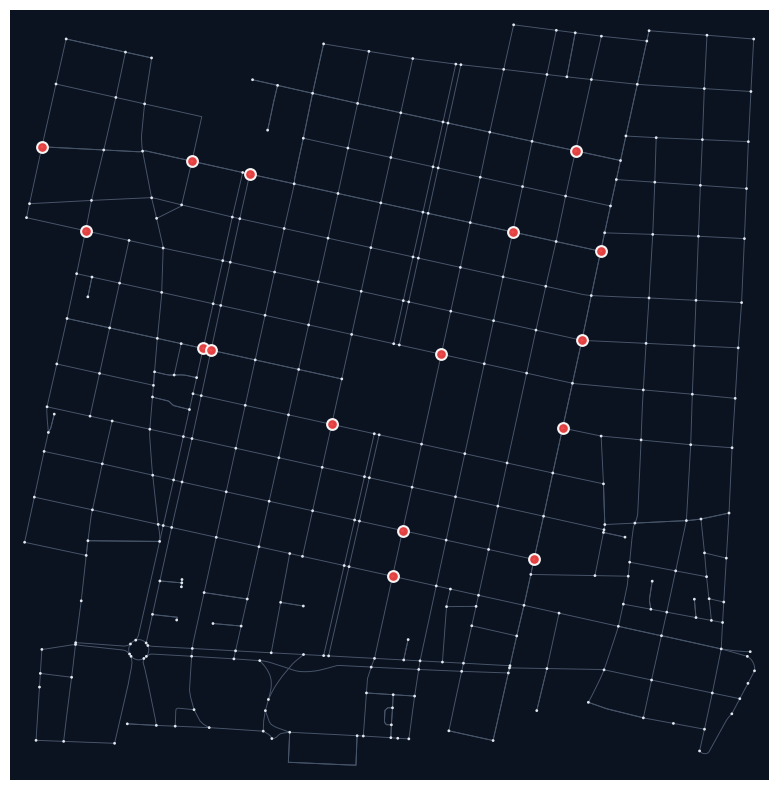
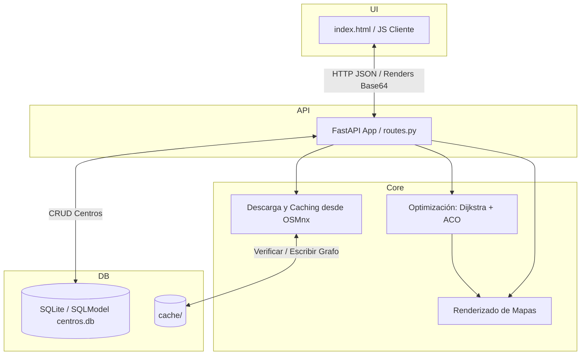
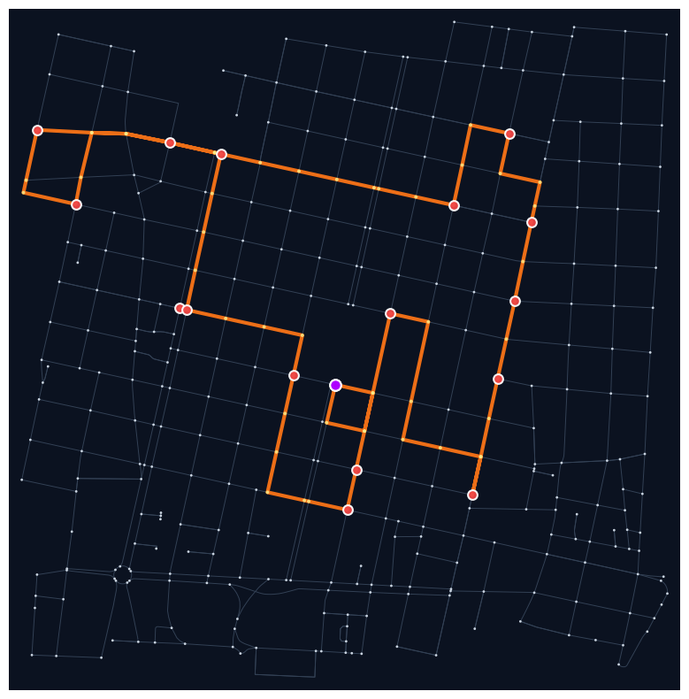
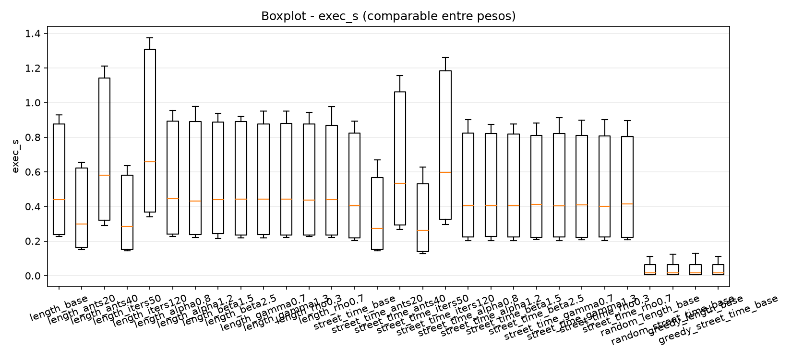
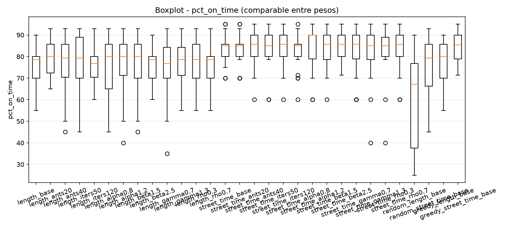
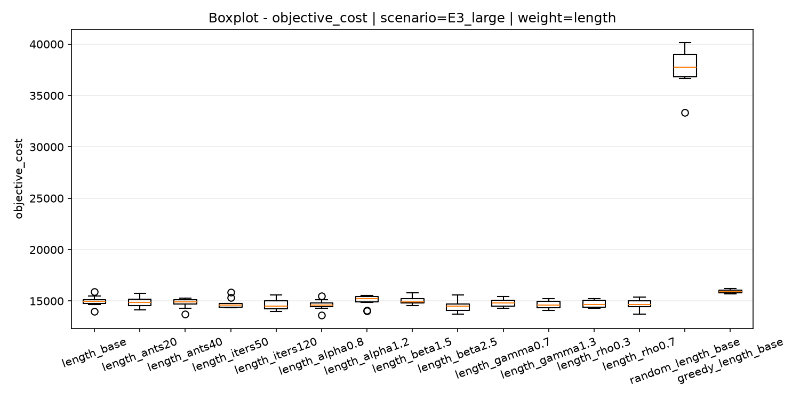

# Optimización Logística para Distribución de Helados

Código de proyecto: HELA2

---

## Índice
- [Introducción](#introducción)
- [Marco Teórico](#marco-teórico)
  - [Problema del Viajero con Ventanas de Tiempo (TSPTW)](#tsptw)
  - [Ant Colony Optimization (ACO)](#aco)
  - [Sistema de Penalizaciones](#penalizaciones)
  - [Comparativa del Modelo](#comparativa)
  - [Tecnologías Utilizadas](#tech)
- [Análisis del Problema](#analisis)
  - [Modelado y Ponderación de la Red Vial](#modelado)
  - [Restricciones del Dominio](#restricciones)
- [Diseño Experimental e Implementación](#diseño)
  - [Arquitectura del Sistema](#arquitectura)
  - [Baselines](#baselines)
- [Resultados](#resultados)
- [Conclusiones](#conclusiones)

---

### Introducción

El presente informe describe una solución computacional a un problema de optimización logística para la distribución de helados de una empresa ficticia en una ciudad cualquiera. 

El problema consiste en encontrar una ruta óptima para un vehículo que parte desde un depósito, visita un conjunto de heladerías y regresa al depósito, minimizando el tiempo total del viaje y cumpliendo con las restricciones del dominio, como las ventanas de tiempo de las heladerías o el límite de carga del camión.

La solución implementa el algoritmo de optimización por colonia de hormigas (ACO) para resolver el Problema del Viajero con Ventanas de Tiempo (TSPTW).

---

### Marco Teórico

#### Problema del Viajero con Ventanas de Tiempo (TSPTW)

El Problema del Viajero (TSP, por sus siglas en inglés: *Traveling Salesperson Problem*) es uno de los problemas de optimización combinatoria y teoría de grafos más estudiados en las ciencias de la computación [5]. Su objetivo consiste en encontrar la ruta más corta posible que visite un conjunto de ubicaciones exactamente una vez y regrese al punto de origen.

Desde la perspectiva de la teoría de la complejidad, el TSP clásico pertenece a la clase **NP-Hard**. Esto significa que es al menos tan difícil como los problemas más complejos de la clase NP y que, por lo tanto, no se conoce un algoritmo capaz de resolverlo en tiempo polinomial en el peor de los casos. A medida que el número de ubicaciones ($n$) crece, el espacio de soluciones posibles aumenta de forma factorial.

En este proyecto, el TSP convencional se ve modificado por la incorporación de restricciones temporales asociadas a cada nodo, lo que transforma el modelo en el **Problema del Viajero con Ventanas de Tiempo (TSPTW)** [7]. 

Para modelar formalmente este escenario sobre la red vial real, se calcula la matriz de caminos mínimos entre todos los puntos clave. Esto permite representar el problema mediante un grafo dirigido completo virtual (ya que el grafo inicial no es un grafo completo) definido como $G = (V, A)$, donde:

$V = \{0, 1, 2, \dots, n\}$ es el conjunto de vértices o nodos. El nodo $0$ representa el depósito central (punto de partida y de retorno de la ruta), mientras que los nodos $1$ hasta $n$ representan las distintas heladerías a visitar.

$A = \{(i, j) \mid i, j \in V, i \neq j\}$ es el conjunto de aristas que representan las trayectorias óptimas de tránsito entre cualquier par de nodos de interés.

Cada arista $(i, j) \in A$ tiene asociado un costo de tránsito o distancia $d_{ij}$ (calculado usando Dijkstra sobre la red real) y un tiempo de viaje estimado $t_{ij}$. Para representar la secuencia de la ruta, se introduce la variable de decisión binaria $x_{ij}$, la cual toma el valor de $1$ si la ruta pasa directamente del nodo $i$ al nodo $j$, y $0$ en caso contrario.

A diferencia del TSPTW clásico, que descarta soluciones que violen los horarios, este proyecto adopta un enfoque de ventanas de tiempo blandas. En este esquema, cada ubicación $i \in V$ está caracterizada por un intervalo temporal preferente de atención $[e_i, l_i]$ y un tiempo de servicio o descarga constante $s$ (equivalente a `unload_time` en la implementación):

- $e_i$ (Earliest arrival time): Es el tiempo más temprano recomendado para iniciar el servicio en el nodo $i$. Si el vehículo arriba en un tiempo $a_i < e_i$, debe esperar hasta la apertura de la ventana (acumulando tiempo de espera), y se le asigna una penalización proporcional al adelanto.

- $l_i$ (Latest arrival time): Es el tiempo máximo recomendado para el arribo al nodo $i$. Si $a_i > l_i$, el servicio se realiza pero se penaliza la demora.

- $s$ (Service time): El tiempo fijo requerido para descargar el producto en cada heladería antes de continuar el viaje (con $s_0 = 0$ para el depósito).

Para medir la viabilidad temporal del recorrido, se introduce la variable continua $w_i$, que define el inicio del servicio en el nodo $i$. Cuando se transita de $i$ a $j$ ($x_{ij} = 1$), la consistencia del flujo temporal se rige por:

$$w_j \ge \max(a_j, e_j) \quad \text{donde} \quad a_j = w_i + s + t_{ij}$$

Al flexibilizar las restricciones temporales mediante penalizaciones, la función objetivo no busca únicamente minimizar la distancia recorrida, sino equilibrar el trayecto con el cumplimiento de las ventanas, la capacidad del vehículo y la jornada máxima de trabajo. Así, la función objetivo de minimización se formaliza como:

$$\min \left( \lambda \sum_{i \in V} \sum_{j \in V, j \neq i} d_{ij} x_{ij} + \mu \cdot P_{\text{total}} \right)$$

Donde $\lambda$ y $\mu$ son coeficientes de ponderación, y $P_{\text{total}}$ es el valor de penalización acumulado por las desviaciones temporales, excesos de capacidad de carga y superación del tiempo total de operación permitido.

Esta formulación suavizada del TSPTW mantiene el carácter NP-Hard del problema original, pero expande el espacio de búsqueda permitiendo al algoritmo explorar de forma heurística soluciones subóptimas en términos de ventanas a cambio de una reducción sustancial en la distancia física recorrida.

---

#### Ant Colony Optimization (ACO)

El algoritmo de optimización por colonia de hormigas (ACO) es una metaheurística estocástica inspirada en el comportamiento de las hormigas reales que buscan el camino más corto entre su nido y una fuente de alimento [5]. Este enfoque se enmarca dentro de la categoría de métodos de optimización basados en enjambres (swarm intelligence), diseñados para resolver problemas de optimización combinatoria complejos.

Estando una hormiga artificial $k$ en el nodo $i$, la selección probabilística de la siguiente heladería a visitar $j$, perteneciente al conjunto de destinos no visitados $\text{Allowed}_k$, se calcula mediante una regla de transición pseudo-proporcional que balancea tres factores esenciales:

$$p_{ij}^k = \frac{[\tau_{ij}]^\alpha \cdot [\eta_{ij}]^\beta \cdot [\psi_{ij}]^\gamma}{\sum_{l \in \text{Allowed}_k} [\tau_{il}]^\alpha \cdot [\eta_{il}]^\beta \cdot [\psi_{il}]^\gamma}$$

Donde:
* **$\tau_{ij}$** representa la concentración del rastro de feromona en el arco $(i, j)$, representando el aprendizaje histórico del enjambre.
* **$\eta_{ij}$** es la visibilidad o heurística local, definida como la inversa del coste del camino mínimo de Dijkstra: $\eta_{ij} = 1 / c_{ij}$. Este coste equivale a la distancia $d_{ij}$ o al tiempo de tránsito $t_{ij}$, según la parametrización de pesos del grafo.
* **$\psi_{ij}$** es el **factor de urgencia temporal** dinámico para el destino $j$, orientado a priorizar los nodos cuyas ventanas horarias están más próximas a vencer.
* **$\alpha, \beta, \gamma$** son coeficientes que regulan el peso de la feromona, la heurística local y la urgencia temporal, respectivamente.

##### Modelado Matemático del Factor de Urgencia Temporal ($\psi_{ij}$)

El factor de urgencia temporal se calcula en tiempo de ejecución estimando la hora de arribo teórica $a_j = w_i + s_i + t_{ij}$ al nodo candidato $j$. Dependiendo de la relación entre $a_j$ y la ventana horaria del destino $[e_j, l_j]$, se aplica la siguiente función a trozos:

$$\psi_{ij} = \begin{cases} 
0.9 & \text{si } a_j < e_j \quad (\text{Arribo Temprano}) \\ 
2.0 - \left( \frac{l_j - a_j}{l_j - e_j} \right) & \text{si } e_j \le a_j \le l_j \quad (\text{Arribo a Tiempo}) \\ 
0.5 - 0.3 \cdot \min\left(1.0, \frac{a_j - l_j}{30}\right) & \text{si } a_j > l_j \quad (\text{Arribo Tardío}) 
\end{cases}$$

Esta formulación desincentiva la llegada temprana asignando un factor menor constante de $0.9$, aumenta progresivamente el peso hacia $2.0$ a medida que se reduce la holgura en arribos puntuales, y degrada el factor hasta un piso de $0.2$ si se excede el límite del cierre para desalentar retrasos severos.

##### Reglas de Actualización de Feromonas en MMAS

El sistema implementa la variante **Max-Min Ant System (MMAS)** [8] para guiar la búsqueda y evitar el estancamiento en óptimos locales mediante cotas extremas $[\tau_{\min}, \tau_{\max}]$:

- Al finalizar cada iteración, el nivel de feromona en todos los arcos se evapora a una tasa $\rho \in (0, 1]$:
   $$\tau_{ij} \leftarrow \max\left(\tau_{\min}, (1 - \rho) \cdot \tau_{ij}\right)$$
- Únicamente la hormiga que construyó el recorrido de menor costo en la iteración actual ($\text{Costo}_{\text{iter-best}}$) deposita feromona en los arcos de su ruta:
   $$\tau_{ij} \leftarrow \min\left(\tau_{\max}, \tau_{ij} + \Delta\tau_{ij}\right) \quad \forall (i, j) \in R_{\text{iter-best}}$$
   Donde el depósito es inversamente proporcional a la calidad de la solución encontrada:
   $$\Delta\tau_{ij} = \frac{Q}{\text{Costo}_{\text{iter-best}}}$$
   Siendo $Q$ una constante de depósito del sistema.

---

#### Sistema de Penalizaciones

La formulación del sistema de penalizaciones responde a la necesidad de transformar un problema de optimización combinatoria multiobjetivo en uno monoobjetivo, permitiendo que la colonia optimice una medida agregada de calidad del recorrido. Para una ruta construida por una hormiga $k$, se definen tres componentes de penalización: 

- **Penalización temporal ($P^T$):** Se calcula sumando las desviaciones respecto a las ventanas horarias en cada heladería visitada $j$. Se penaliza tanto la llegada temprana (que obliga a esperar) como la tardía (demora respecto al cierre de la ventana):

$$ P^T = \sum_{j \in V \setminus \{0\}} \left( \max\left(0, e_j - a_j\right) + \max\left(0, a_j - l_j\right) \right) $$

Donde $a_j$ representa el tiempo de arribo al nodo $j$, $e_j$ el tiempo de apertura más temprano y $l_j$ el tiempo máximo de atención permitido.

- **Penalización de capacidad ($P^C$):** Se calcula a nivel global para toda la ruta. Si la demanda total de todas las heladerías del recorrido supera la capacidad máxima de carga del camión ($C$), se genera una penalización proporcional al exceso:

$$ P^C = \max\left(0, \sum_{j \in V \setminus \{0\}} d_j - C\right) $$

Donde $d_j$ representa la demanda de cada heladería.

> [!NOTE]
> Dado que este modelo representa un escenario de ruteo con un único vehículo que visita de forma obligatoria el conjunto total de heladerías en cada recorrido completo, la suma de las demandas $\sum d_j$ es una constante para cualquier tour. En consecuencia, la penalización de capacidad $P^C$ actúa como un coste de ajuste fijo determinado por el escenario y no varía dinámicamente entre las distintas permutaciones de la ruta.

- **Penalización de jornada laboral ($P^J$):** Se genera a nivel global si la duración total de la ruta (incluyendo tiempos de tránsito y descarga en cada nodo) sobrepasa la jornada máxima permitida $T_{\text{max}}$:

$$ P^J = \max\left(0, \text{Tiempo Total} - T_{\text{max}}\right) $$

Una vez obtenidas estas componentes, se calcula la **Penalización Total** ponderada de la ruta mediante los factores de penalización del algoritmo ($\alpha_p, \beta_p, \gamma_p$):

$$ P_{\text{total}} = \alpha_p P^T + \beta_p P^C + \gamma_p P^J $$

Finalmente, la función objetivo minimiza un costo consolidado que equilibra la distancia total recorrida con las penalizaciones de la ruta, utilizando los coeficientes de ponderación de la optimización ($\lambda$ y $\mu$):

$$ \text{Costo}(R_k) = \lambda \cdot \text{Distancia Total} + \mu \cdot P_{\text{total}} $$

Al incorporar las penalizaciones en la función objetivo, el sistema de ACO puede explorar trayectorias que, aunque físicamente más largas, resulten en un menor costo operativo global al minimizar las demoras, respetar las ventanas de tiempo y mantener la carga dentro de los límites del vehículo.

#### Comparativa del Modelo

Para comprender la ubicación teórica de la solución desarrollada en este proyecto dentro del campo de la investigación operativa, es necesario distinguir formalmente entre los distintos modelos clásicos de ruteo y el modelo híbrido implementado en el sistema HELA2:

* **Traveling Salesperson Problem (TSP) [5]:** El modelo más simple de ruteo. Consta de un único vehículo sin capacidad máxima y con la obligación de visitar un conjunto de nodos minimizando únicamente la distancia o el tiempo de trayecto, libre de cualquier restricción temporal o de carga.
* **Traveling Salesperson Problem with Time Windows (TSPTW) [7]:** Extiende el TSP introduciendo ventanas horarias $[e_i, l_i]$ específicas para cada nodo. Tradicionalmente, este modelo impone restricciones duras, donde cualquier desviación es considerada estrictamente no factible, invalidando la solución.
* **Vehicle Routing Problem with Time Windows (VRPTW) [1]:** Generaliza el problema hacia múltiples vehículos que parten de un depósito central y atienden un conjunto de demandas respetando ventanas horarias de clientes y límites de capacidad física de carga ($C$) del vehículo de forma simultánea.
* **Modelo Implementado en HELA2:** Se clasifica conceptualmente como un **TSPTW Generalizado con Ventanas de Tiempo Blandas y Penalizaciones**. Es un problema monovehículo (como el TSPTW), pero suaviza el cumplimiento de ventanas temporales permitiendo entregas fuera de término a cambio de penalizaciones matemáticas en la función objetivo, adaptando aproximaciones dinámicas de la logística urbana moderna [6].

---

#### Tecnologías Utilizadas

Las herramientas y tecnologías utilizadas en el desarrollo de este proyecto son:

- Python 3.14
- FastAPI (interfaz web y API)
- NetworkX (librería para trabajar con grafos)
- OSMNX (interfaz con OpenStreetMap para obtener grafos viales de ciudades)
- SQLModel (modelado de la base de datos)
- SQLite (base de datos utilizada para cachear ciertos datos)
- Pandas y Matplotlib (análisis y visualización de datos)

---

### Análisis del Problema

#### Modelado y Ponderación de la Red Vial

Habiendo ya el modelo matemático utilizado para diseñar el problema, se puede proceder a describir algunos detalles de la implementación.

En primer lugar, se tiene que, al ser un grafo ponderado, las aristas tienen un peso asociado que representa la distancia entre dos nodos. Este puede ser expresado de dos formas, elegibles al momento de ejecutar el algoritmo:

- `length`: distancia en metros
- `street_time`: tiempo estimado en segundos

Podemos decir que `length` es el peso *default* del algoritmo ya que es el obtenido directamente desde OpenStreetMap, sin embargo, en caso de que el usuario desee, se puede utilizar `street_time` como peso del grafo. Este último fue considerado como opción teniendo en cuenta la velocidad promedio de un camión y la máxima de las calles, intentando simular un escenario lo más realista posible.

`street_time` se calcula de la siguiente forma:

$$t_{\text{street}} = \frac{l}{\frac{v_{\text{max}}}{3.6}}$$

Donde:

* **$l$** es la longitud física del segmento de calle en metros (el atributo `length` proveniente de OpenStreetMap).

* **$v_{\text{max}}$** es la velocidad máxima de la calle permitida en km/h. Se divide por $3.6$ para convertir el valor a metros por segundo ($m/s$), logrando que el tiempo resultante ($t_{\text{street}}$) se exprese en segundos.

Dado que la red vial real extraída de OpenStreetMap no siempre cuenta con información explícita de límites de velocidad para cada tramo, se implementó la función [`_ensure_street_time`](../src/core/graph.py#L22) que, en una primera instancia, intenta obtener el valor del atributo `maxspeed`. Si no existe, se infiere a partir de [`SPEED_DEFAULTS`](../src/core/graph.py#L9), que asigna valores arbitrarios en base al tipo de calle. La descarga y estructuración del grafo de la red vial se realiza mediante la librería `OSMnx` [3].

La siguiente figura ilustra la red vial urbana ($G$) descargada y proyectada para un radio de $1000\text{ metros}$ en torno a la Plaza Independencia de Mendoza, marcando en rojo la localización geográfica de las heladerías (puntos de interés) que conforman el conjunto $V'$:

---

#### Restricciones del Dominio

Como se mencionó anteriormente, las restricciones aplicadas en el algoritmo son **blandas**. Esto significa que el algoritmo no descarta una solución por el hecho de no cumplir alguna restricción, sino que le asigna una penalización matemática en la función objetivo proporcional a la gravedad del incumplimiento. Este enfoque permite al algoritmo explorar todo el espacio de soluciones posibles y es de extrema utilidad en escenarios saturados donde no existe una ruta factible que pueda cumplir simultáneamente el 100% de las restricciones.

Las tres restricciones existentes son:

* **Capacidad de Carga del Vehículo:** Representa el límite físico de almacenamiento del camión. Cada heladería tiene una demanda asociada $d_i$. Aunque operativamente en el mundo real esta es una restricción dura (el camión no puede transportar más de su límite físico), en el modelo de optimización se relaja como una restricción blanda mediante la penalización global $P^C$. Esto permite evaluar de forma numérica la inviabilidad de las rutas sobrecargadas en lugar de simplemente interrumpir la simulación.

* **Ventanas de Tiempo de Entrega:** Cada heladería establece un intervalo preferente para recibir mercadería $[e_i, l_i]$. Las llegadas tempranas ($a_i < e_i$) obligan al camión a esperar, mientras que las tardías ($a_i > l_i$) degradan la calidad del servicio, penalizándose en la variable acumuladora $P^T$.

* **Jornada Laboral Máxima:** Establece el tiempo de operación máximo permitido para el vehículo y el conductor ($T_{\text{max}}$). El exceso de tiempo total de la ruta sobre este límite es penalizado a través de $P^J$. En este caso, en un escenario real, también podría considerarse como una restricción dura, pero podemos pensarlo como "horas extra" para el conductor.

---

### Diseño Experimental e Implementación

#### Arquitectura del Sistema

La implementación de la solución propuesta se rige por un diseño estructurado en capas. Esta separación de responsabilidades asegura la modularidad del código, facilita el cacheado de subgrafos locales y aísla el motor algorítmico de la interfaz de usuario y del acceso a datos.

##### Estructura de Componentes y Capas

El sistema se compone de cinco capas principales que interactúan de forma lineal para resolver peticiones de optimización en tiempo real:

1. **UI:** Compuesto por una interfaz web responsiva ([index.html](../src/templates/index.html)) escrita en HTML5 y JavaScript. Gestiona la captura de parámetros (ubicaciones, pesos, coeficientes de optimización) y despliega dinámicamente los mapas y registros de arribos devueltos por el backend.

2. **API:** Consiste en la API expuesta por **FastAPI** ([routes.py](../src/api/routes.py)), la cual orquesta el flujo de ejecución del sistema.

3. **Core:** Constituye el núcleo conceptual de la aplicación. Incluye la descarga y limpieza de grafos viales ([graph.py](../src/core/graph.py)), la consulta de heladerías objetivo ([osm.py](../src/core/osm.py)), transformaciones geométricas y cálculo de distancias ([geometry.py](../src/core/geometry.py)), el algoritmo ([algorithms.py](../src/core/algorithms.py)), y el motor gráfico de renderizado de rutas ([renders.py](../src/visualization/renders.py)).

4. **DB:** Administra el almacenamiento persistente estructurado de centros de distribución en SQLite mediante **SQLModel** ([database.py](../src/models/database.py)) y la retención local no volátil de la topología de ciudades en formato Pickle en el directorio `cache/`.

A continuación, se ilustra la topología de dependencias e intercambio de datos del sistema:

##### Abstracción y Virtualización del Grafo

Una de las decisiones de diseño arquitectónico más críticas es la *virtualización del grafo vial*. La red vial real obtenida desde OpenStreetMap es un multígrafo dirigido disperso $G = (V, A)$, donde el número de nodos es masivo ($|V| \sim 10^3 - 10^5$). Navegar este grafo físico directamente durante la toma de decisiones estocásticas de los agentes implicaría un costo computacional inviable. Para mitigar esto, el sistema implementa un paso de reducción de dimensionalidad y abstracción topológica en la capa de datos viales previo a la optimización [2]:

1. Se define un subconjunto de nodos de interés $V' = \{v_0, v_1, \dots, v_m\} \subset V$, donde $v_0$ representa el nodo proyectado del depósito central y $\{v_1, \dots, v_m\}$ son los nodos correspondientes a las heladerías.

2. Para cada par ordenado $(i, j)$ con $i, j \in V', i \neq j$, se calcula el camino mínimo y su coste respectivo sobre $G$ empleando el algoritmo de Dijkstra [4]:

   $$d_{ij} = \text{Dijkstra}(G, i, j, \text{weight})$$

3. Se define un grafo dirigido completo virtual $G' = (V', A')$, donde cada arista dirigida $(i, j) \in A'$ tiene como atributos asociados la distancia $d_{ij}$ (en caso de elegir `length`) o el tiempo de viaje estimado $t_{ij}$ (en caso de elegir `street_time`). El motor de optimización opera exclusivamente sobre este grafo completo virtualizado, eliminando las intersecciones viales intermedias durante el cálculo del recorrido.

4. Una vez resuelto el tour óptimo en $G'$, se realiza un mapeo inverso consultando las trayectorias detalladas de Dijkstra en $G$ para trazar la ruta exacta sobre la red de calles física.

##### Flujo de Ejecución

El procesamiento de una solicitud de optimización sigue un flujo síncrono que conecta todas las capas del sistema:

1. Las coordenadas geográficas decimales (WGS84) del origen y de las heladerías son proyectadas de manera ortogonal hacia el nodo topológico más cercano en el grafo de calles.

2. Se calcula la matriz de distancias y tiempos de tránsito entre todos los nodos del subconjunto $V'$ en el grafo vial simplificado.

3. Se inicializan las variables del problema y se transfieren al resolvedor algorítmico junto con la seed aleatoria del sistema.

4. Se invoca la ejecución del resolvedor correspondiente en [algorithms.py](../src/core/algorithms.py).

5. Se genera la imagen final superponiendo la ruta urbana real y los marcadores de las heladerías en diferentes colores (verde para origen, rojo para entregas, violeta para retorno) sobre la cartografía de la ciudad.

---

#### Baselines

Para poder comparar los resultados obtenidos, se decidió tomar como baseline dos métodos de optimización:

- Un algoritmo greedy que elige en cada paso la heladería más cercana a la actual.

- Un agente random que selecciona aleatoriamente la siguiente heladería a visitar.

---

### Resultados

El rendimiento de la metaheurística propuesta se evaluó de forma empírica contrastando el comportamiento de ACO configurado en su versión base (`length_base` y `street_time_base`, con parámetros `alpha=1`, `beta=2`, `rho=0.5`, `q=100`) y en sus mejores configuraciones paramétricas, frente a los dos baselines presentados anteriormente. Las pruebas de simulación se desarrollaron sobre tres escenarios de distribución en Mendoza, Argentina. Los resultados presentados a continuación corresponden al valor de la mediana obtenido sobre 10 ejecuciones independientes.

> [!NOTE]
> La nomenclatura de las configuraciones se estructura de la siguiente forma:
> 
> - `{weight}_{variation}`
> 
> Cada configuración tiene solo una variación en uno de los parámetros con respecto a la configuración base (descrita en el párrafo anterior). Por ejemplo:
> 
> - `length_rho0.3` $\rightarrow$ igual a `length_base`, pero con `rho=0.3` en lugar de `rho=0.5`.

A modo de ilustración de las salidas de la aplicación, las siguientes imágenes muestran la comparación entre el mapa base de heladerías geolocalizadas y la trayectoria real reconstruida sobre la red de calles física para recorrer el tour óptimo calculado por el motor de ACO:

| Red Vial y Heladerías | Ruta Construida |
| :---: | :---: |
|  |  |

##### `weight = length`

| Escenario | Algoritmo / Configuración | Costo (m) | Costo con Penalizaciones | Entregas a Tiempo (%) | Penalización Temporal (min) | Tiempo de Ejecución (s) |
| :--- | :--- | :---: | :---: | :---: | :---: | :---: |
| **E1: Pequeño** (10 Clientes, Radio 900m) | Random (`random_length_base`) | 10.686 | 10.878 | 80,0% | 176,9 | 0,006 |
| | Greedy (`greedy_length_base`) | 5.921 | 6.045 | 90,0% | 123,9 | 0,006 |
| | Standard ACO (`length_base`) | 5.443 | 5.531 | 80,0% | 102,6 | 0,235 |
| | **Best ACO (`length_rho0.3`)** | **5.196** | **5.327** | **80,0%** | **88,8** | **0,231** |
| **E2: Mediano** (14 Clientes, Radio 1200m) | Random | 16.186 | 16.441 | 67,8% | 264,3 | 0,017 |
| | Greedy | 9.611 | 9.726 | 85,7% | 115,2 | 0,016 |
| | Standard ACO | 8.321 | 8.560 | 78,5% | 184,2 | 0,439 |
| | **Best ACO (`length_ants40`)** | **8.070** | **8.244** | **82,1%** | **159,1** | **0,579** |
| **E3: Grande** (20 Clientes, Radio 1800m) | Random | 34.753 | 37.742 | 30,0% | 2.944,1 | 0,068 |
| | Greedy | 15.346 | 15.927 | 62,5% | 580,9 | 0,064 |
| | Standard ACO | 14.424 | 14.984 | 65,0% | 557,7 | 0,899 |
| | **Best ACO (`length_beta2.5`)** | **14.037** | **14.519** | **70,0%** | **451,1** | **0,900** |

Los resultados muestran que en la optimización por distancia, ACO estándar supera sistemáticamente a la heurística greedy, logrando mejoras del 8,1% (E1), 13,4% (E2) y 6,0% (E3). 

Al introducir el barrido de parámetros, la mejor configuracion encontrada incrementa la ventaja frente a greedy hasta un **12,2%** en el escenario pequeño, **16,0%** en el mediano y **8,5%** en el grande. Esto demuestra la capacidad del enjambre para reestructurar la ruta espacial óptima evadiendo cruces e ineficiencias locales en las que el algoritmo codicioso queda atrapado.

##### `weight = street_time`

| Escenario | Algoritmo / Configuración | Costo Objetivo (s) | Costo con Penalizaciones | Entregas a Tiempo (%) | Penalización Temporal (min) | Tiempo de Ejecución (s) |
| :--- | :--- | :---: | :---: | :---: | :---: | :---: |
| **E1: Pequeño** (10 Clientes, Radio 900m) | Random | 882,9 | 1.027,2 | 85,0% | 135,8 | 0,006 |
| | Greedy | 462,9 | 591,8 | 90,0% | 128,9 | 0,006 |
| | Standard ACO | 460,2 | 582,0 | 80,0% | 102,8 | 0,216 |
| | **Best ACO (`street_time_alpha0.8`)** | **462,9** | **558,9** | **80,0%** | **93,4** | **0,214** |
| **E2: Mediano** (14 Clientes, Radio 1200m) | Random | 1.347,9 | 1.486,1 | 85,7% | 135,2 | 0,015 |
| | Greedy | 729,4 | 852,4 | 85,7% | 122,9 | 0,015 |
| | Standard ACO | 726,0 | 832,2 | 85,7% | 117,4 | 0,406 |
| | **Best ACO (`street_time_alpha0.8`)** | **698,4** | **798,9** | **85,7%** | **103,0** | **0,406** |
| **E3: Grande** (20 Clientes, Radio 1800m) | Random | 2.816,3 | 3.386,9 | 62,5% | 516,0 | 0,065 |
| | Greedy | 1.299,5 | 1.475,1 | 77,5% | 175,5 | 0,066 |
| | Standard ACO | 1.227,4 | 1.330,6 | 85,0% | 103,2 | 0,836 |
| | **Best ACO (`street_time_alpha0.8`)** | **1.214,2** | **1.314,7** | **85,0%** | **90,5** | **0,834** |

Cuando se optimiza sobre el tiempo de viaje, la brecha de rendimiento de la solución base de ACO respecto a greedy es menor en escenarios de baja escala (0,5% en E1), pero se acentúa de forma notable a gran escala, alcanzando una mejora de costo objetivo del **9,7%** en E3. El ACO optimizado (`street_time_alpha0.8`) profundiza esta eficiencia reduciendo el costo objetivo combinado frente al greedy en un **5,5%** (E1), **6,2%** (E2) y **10,8%** (E3).

##### Hallazgos y Análisis Estadístico

###### A. Comportamiento de Escalabilidad Temporal

El análisis de los tiempos de cómputo revela el comportamiento clásico de la metaheurística frente a aproximaciones deterministas:

* Los baselines **Random** y **Greedy** exhiben una respuesta casi instantánea, fluctuando entre $0,006$ segundos para $N=10$ y $0,065$ segundos para $N=20$.
* El algoritmo **ACO** requiere una carga computacional significativamente mayor debido a las múltiples iteraciones del enjambre de hormigas, tomando $\approx 0,23$ segundos para $N=10$ y escalando hasta $\approx 0,90$ segundos para $N=20$.

A pesar del incremento de tiempo de CPU, es fundamental notar que el algoritmo ACO resuelve instancias de hasta 20 heladerías en **menos de 1 segundo**. Desde una perspectiva logística en el mundo real, este tiempo es mas que valido.

###### B. Diferencias en Puntualidad

Los experimentos revelan una discrepancia estructural en la calidad de la solución según la métrica optimizada:

1. En la optimización por **Distancia**, existe un desequilibrio de magnitudes en la función objetivo: una diferencia de 1 metro en la ruta física equivale linealmente a 1 minuto de retraso en la penalización de ventana. La colonia de hormigas prioriza la reducción de la trayectoria del camión, aceptando grandes penalizaciones de tiempo y reduciendo la puntualidad hasta valores de $70,0\%$ en el escenario E3.

2. En la optimización por **Tiempo de Viaje**, la escala de tiempo de tránsito en calles y las penalizaciones de retrasos guardan una proporción mucho más armónica. Esto fuerza al algoritmo a encontrar rutas balanceadas que reducen considerablemente las penalizaciones de entrega (ej. solo $90,5$ minutos de penalización en E3 frente a los $451,1$ minutos del modo distancia), logrando tasas de puntualidad significativamente superiores ($85,0\%$ frente a $70,0\%$).

###### C. Sensibilidad e Impacto de Hiperparámetros

La distribución de costos muestra una alta sensibilidad frente a los coeficientes de control:

* **Baja dependencia de feromonas ($\alpha = 0,8$):** La reducción de $\alpha$ por debajo del valor estándar demostró el mejor rendimiento en la optimización por tiempo. Esto se debe a que restar peso a la memoria colectiva intensifica la exploración de las hormigas, previniendo que la colonia converja prematuramente hacia minimos locales o bucles cerrados.

* **Fuerte peso heurístico ($\beta = 2.5$):** En escenarios extensos de distancia, incrementar $\beta$ presiona a las hormigas a construir tours guiados fuertemente por la cercanía vial local de Dijkstra.

---

### Conclusiones

La realización de este proyecto permite extraer las siguientes conclusiones:

1. La técnica de proyectar la red de calles física $G$ a un grafo dirigido completo virtual $G' = (V', A')$ compuesto únicamente por los nodos de interés precomputados con Dijkstra es un acierto de diseño clave. Aísla las complejidades de la topología urbana y reduce drásticamente el espacio de búsqueda del resolvedor, permitiendo que la metaheurística converja en tiempos de cómputo óptimos inferiores a 1 segundo para instancias de hasta 20 heladerías.

2. Los resultados empíricos demuestran que optimizar rutas bajo el criterio de tiempo de viaje (`street_time`) proporciona un balance multiobjetivo muy superior al de distancia física (`length`). Al armonizar las magnitudes de la función de coste (segundos de viaje y minutos de penalización horaria), se obtienen recorridos reales con tasas de puntualidad significativamente más altas.

3. ACO demostró una clara ventaja frente a los baselines planteados, reduciendo el costo total hasta en un 16,0% en distancia y un 10,8% en tiempo de tránsito. El barrido y seleccion de los mejores parametros, especificamente reduciendo la persistencia de feromona ($\alpha = 0,8$) para evitar la convergencia prematura e incrementando la visibilidad local ($\beta = 2,5$), fue de gran utilidad para descubrir patrones y resolver el problema en entornos de alta saturación y ventanas de tiempo estrictas.

---

### Referencias

1. Basso, F., D'Amours, S., Rönnqvist, M., & Weintraub, A. (2019). A survey on vehicle routing problems with time windows and real-world constraints. *European Journal of Operational Research*, *275*(1), 1–17. [https://doi.org/10.1016/j.ejor.2018.08.034](https://doi.org/10.1016/j.ejor.2018.08.034)

2. Bast, H., Delling, D., Goldberg, A., Müller-Hannemann, M., Pajor, T., Sanders, P., Wagner, D., & Werneck, R. F. (2016). Route planning in transportation networks. In L. Kliemann & P. Sanders (Eds.), *Algorithm Engineering: Selected Results and Surveys* (pp. 19–80). Springer. [https://doi.org/10.1007/978-3-319-49487-6_2](https://doi.org/10.1007/978-3-319-49487-6_2)

3. Boeing, G. (2017). OSMnx: New methods for acquiring, constructing, analyzing, and visualizing complex street networks. *Computers, Environment and Urban Systems*, *65*, 126–139. [https://doi.org/10.1016/j.compenvurbsys.2017.05.004](https://doi.org/10.1016/j.compenvurbsys.2017.05.004)

4. Dijkstra, E. W. (1959). A note on two problems in connexion with graphs. *Numerische Mathematik*, *1*(1), 269–271. [https://doi.org/10.1007/BF01386390](https://doi.org/10.1007/BF01386390)

5. Dorigo, M., & Stützle, T. (2004). *Ant colony optimization*. MIT Press. [https://doi.org/10.7551/mitpress/1290.001.0001](https://doi.org/10.7551/mitpress/1290.001.0001)

6. Mancini, S. (2016). A real-life vehicle routing problem with time windows and temporal urgency in city logistics. *Transportation Research Part C: Emerging Technologies*, *70*, 240–255. [https://doi.org/10.1016/j.trc.2015.06.017](https://doi.org/10.1016/j.trc.2015.06.017)

7. Solomon, M. M. (1987). Algorithms for the vehicle routing and scheduling problems with time window constraints. *Operations Research*, *35*(2), 254–265. [https://doi.org/10.1287/opre.35.2.254](https://doi.org/10.1287/opre.35.2.254)

8. Stützle, T., & Hoos, H. H. (2000). MAX-MIN Ant System. *Future Generation Computer Systems*, *16*(8), 889–914. [https://doi.org/10.1016/S0167-739X(99)00150-X](https://doi.org/10.1016/S0167-739X(99)00150-X)

