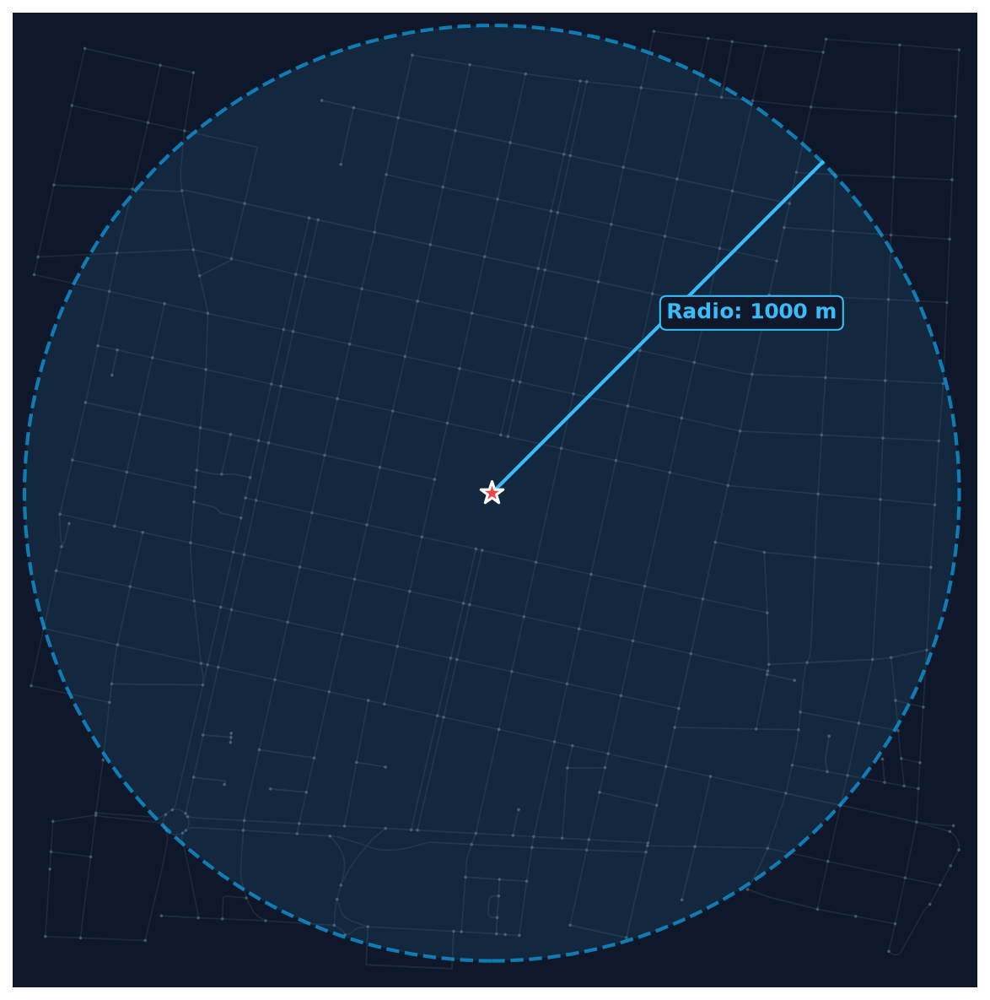
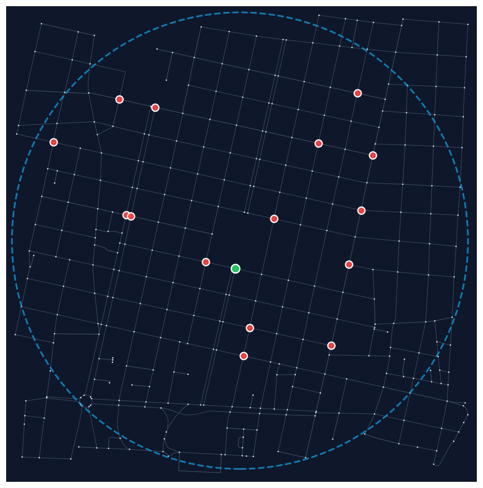
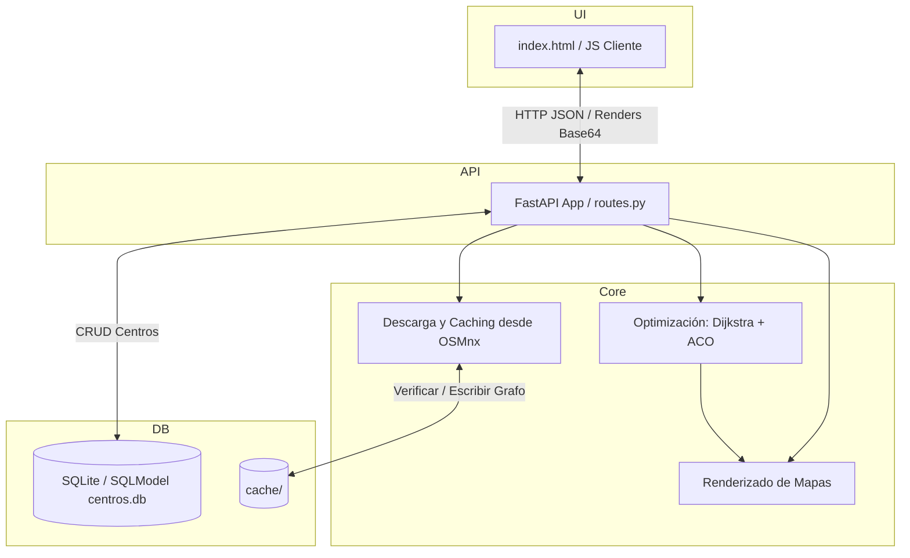
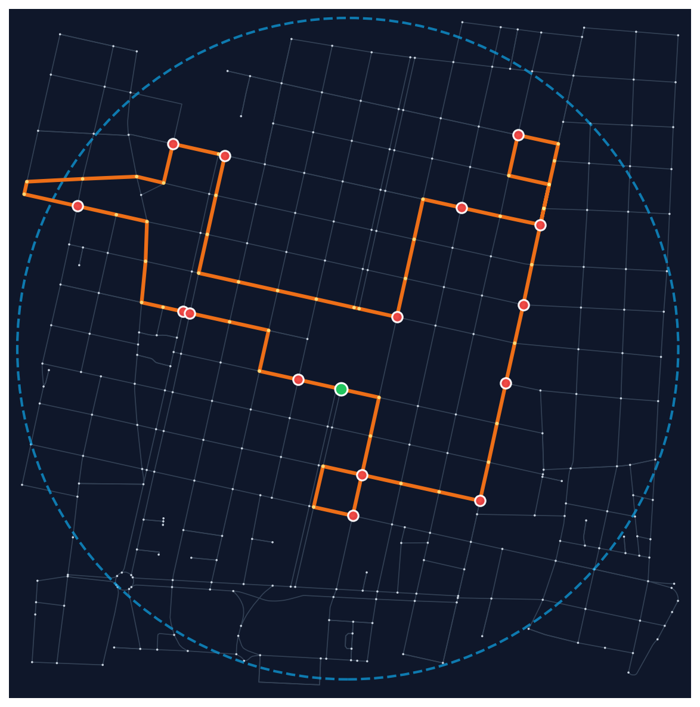
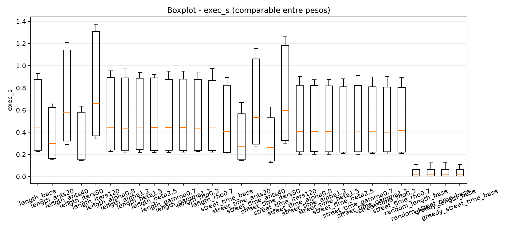
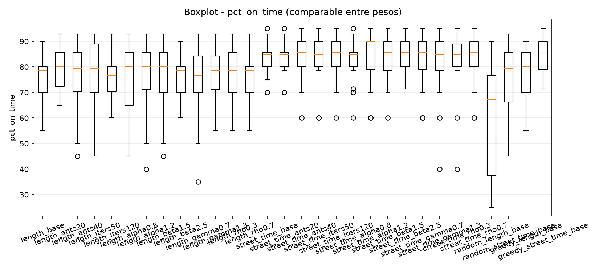
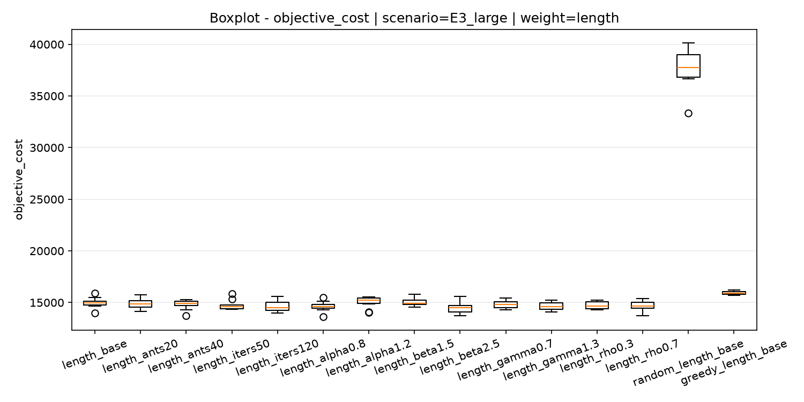

# Optimización Logística para Distribución de Helados

Código de proyecto: HELA2

---

## Índice
- [Introducción](#introducción)
- [Marco Teórico](#marco-teórico)
  - [Problema del Viajero con Ventanas de Tiempo (TSPTW)](#tsptw)
  - [Ant Colony Optimization (ACO)](#aco)
  - [Sistema de Penalizaciones](#penalizaciones)
  - [Taxonomía y Comparativa del Modelo](#comparativa)
  - [OpenStreetMap](#osm)
  - [Tecnologías Utilizadas](#tech)
- [Análisis del Problema](#analisis)
  - [Modelado y Ponderación de la Red Vial](#modelado)
  - [Restricciones del Dominio](#restricciones)
- [Diseño Experimental e Implementación](#diseño)
  - [Arquitectura del Sistema](#arquitectura)
  - [Baselines](#baselines)
  - [Métricas de Evaluación](#metricas)
- [Metodología y Configuración Experimental](#metodologia)
  - [Procedimiento Experimental](#procedimiento)
  - [Parámetros del Resolvedor y Barrido](#parametros)
  - [Escenarios de Prueba](#escenarios)
- [Resultados](#resultados)
- [Análisis y Discusión de Resultados](#discusion)
- [Conclusiones](#conclusiones)

---

### Introducción

Este informe presenta una solución de optimización logística mediante el algoritmo ACO para la distribución de helados en la red vial de Mendoza. 

El problema consiste en encontrar una ruta para un vehículo que parte desde un depósito, visita un conjunto de heladerías y regresa al depósito, minimizando el tiempo total del viaje y cumpliendo con las restricciones del dominio, como las ventanas de tiempo de las heladerías o el límite de carga del camión.

La solución implementa el algoritmo de optimización por colonia de hormigas (ACO) para resolver el Problema del Viajero con Ventanas de Tiempo (TSPTW).

---

### Marco Teórico

#### Problema del Viajero con Ventanas de Tiempo (TSPTW)

El Problema del Viajero (TSP, por sus siglas en inglés: *Traveling Salesperson Problem*) es uno de los problemas de optimización combinatoria y teoría de grafos más estudiados en las ciencias de la computación [5]. Su objetivo consiste en encontrar la ruta más corta posible que visite un conjunto de ubicaciones exactamente una vez y regrese al punto de origen.

Desde la perspectiva de la teoría de la complejidad, el TSP clásico pertenece a la clase **NP-Hard**. Esto significa que es al menos tan difícil como los problemas más complejos de la clase NP y que, por lo tanto, no se conoce un algoritmo capaz de resolverlo en tiempo polinomial en el peor de los casos. A medida que el número de ubicaciones ($n$) crece, el espacio de soluciones posibles aumenta de forma factorial.

En este proyecto, el TSP convencional se ve modificado por la incorporación de restricciones temporales asociadas a cada nodo, lo que transforma el modelo en una adaptación del **Problema del Viajero con Ventanas de Tiempo (TSPTW)** [7].

Para modelar formalmente este escenario sobre la red vial real, se calcula la matriz de caminos mínimos entre todos los puntos clave. Esto permite representar el problema mediante un grafo dirigido completo virtual (ya que el grafo vial real no es completo) definido como $G' = (V', A')$, donde:

$V' = \{0, 1, 2, \dots, n\}$ es el conjunto de vértices o nodos de interés. El nodo $0$ representa el depósito central (punto de partida y de retorno de la ruta), mientras que los nodos $1$ hasta $n$ representan las distintas heladerías a visitar.

$A' = \{(i, j) \mid i, j \in V', i \neq j\}$ es el conjunto de aristas virtuales que representan las trayectorias de tránsito entre cualquier par de nodos de interés.

Cada arista $(i, j) \in A'$ tiene asociado un costo de tránsito o distancia $d_{ij}$ (calculado usando Dijkstra sobre la red real) y un tiempo de viaje estimado $t_{ij}$. Para representar la secuencia de la ruta, se introduce la variable de decisión binaria $x_{ij}$, la cual toma el valor de $1$ si la ruta pasa directamente del nodo $i$ al nodo $j$, y $0$ en caso contrario.

A diferencia del TSPTW clásico, que descarta soluciones que violen los horarios, este proyecto adopta un enfoque de ventanas de tiempo blandas. En este esquema, cada ubicación $i \in V'$ está caracterizada por un intervalo temporal preferente de atención $[e_i, l_i]$ y un tiempo de servicio o descarga constante $s$ (equivalente a `unload_time` en la implementación):

- $e_i$ (Earliest arrival time): Es el tiempo más temprano recomendado para iniciar el servicio en el nodo $i$. Si el vehículo arriba en un tiempo $a_i < e_i$, debe esperar hasta la apertura de la ventana (acumulando tiempo de espera), y se le asigna una penalización proporcional al adelanto.

- $l_i$ (Latest arrival time): Es el tiempo máximo recomendado para el arribo al nodo $i$. Si $a_i > l_i$, el servicio se realiza pero se penaliza la demora.

- $s$ (Service time): El tiempo fijo requerido para descargar el producto en cada heladería antes de continuar el viaje (con $s_0 = 0$ para el depósito).

Para medir la viabilidad temporal del recorrido, se introduce la variable continua $w_i$, que define el inicio del servicio en el nodo $i$. Cuando se transita de $i$ a $j$ ($x_{ij} = 1$), la consistencia del flujo temporal se rige por:

$$w_j \ge \max(a_j, e_j) \quad \text{donde} \quad a_j = w_i + s + t_{ij}$$

Al flexibilizar las restricciones temporales mediante penalizaciones, la función objetivo no busca únicamente minimizar la distancia recorrida, sino equilibrar el trayecto con el cumplimiento de las ventanas, la capacidad del vehículo y la jornada máxima de trabajo. Así, la función objetivo de minimización se formaliza como:

$$\min \left( \lambda \sum_{i \in V'} \sum_{j \in V', j \neq i} d_{ij} x_{ij} + \mu \cdot P_{\text{total}} \right)$$

Donde $\lambda$ y $\mu$ son coeficientes de ponderación, y $P_{\text{total}}$ es el valor de penalización acumulado por las desviaciones temporales, excesos de capacidad de carga y superación del tiempo total de operación permitido.

Esta formulación suavizada del TSPTW mantiene el carácter NP-Hard del problema original, pero expande el espacio de búsqueda permitiendo al algoritmo explorar de forma heurística soluciones subóptimas en términos de ventanas a cambio de una reducción sustancial en la distancia física recorrida.

---

#### Ant Colony Optimization (ACO)

El algoritmo de optimización por colonia de hormigas (ACO) es una metaheurística estocástica inspirada en el comportamiento de las hormigas reales que buscan el camino más corto entre su nido y una fuente de alimento [5]. Este enfoque se enmarca dentro de la categoría de métodos de optimización basados en enjambres (swarm intelligence), diseñados para resolver problemas de optimización combinatoria complejos.

Estando una hormiga artificial $k$ en el nodo $i$, la selección probabilística de la siguiente heladería a visitar $j$, perteneciente al conjunto de destinos no visitados $\text{Allowed}_k$, se calcula mediante una regla de transición pseudo-proporcional que balancea tres factores esenciales:

$$p_{ij}^k = \frac{[\tau_{ij}]^\alpha \cdot [\eta_{ij}]^\beta \cdot [\psi_{ij}]^\gamma}{\sum_{l \in \text{Allowed}_k} [\tau_{il}]^\alpha \cdot [\eta_{il}]^\beta \cdot [\psi_{il}]^\gamma}$$

Donde:
* **$\tau_{ij}$** representa la concentración del rastro de feromona en el arco $(i, j)$, representando el aprendizaje histórico del enjambre.
* **$\eta_{ij}$** es la visibilidad o heurística local, definida como la inversa del coste del camino mínimo de Dijkstra: $\eta_{ij} = 1 / c_{ij}$. Este coste equivale a la distancia $d_{ij}$ o al tiempo de tránsito $t_{ij}$, según la parametrización de pesos del grafo.
* **$\psi_{ij}$** es el **factor de urgencia temporal** dinámico para el destino $j$, orientado a priorizar los nodos cuyas ventanas horarias están más próximas a vencer.
* **$\alpha, \beta, \gamma$** son coeficientes que regulan el peso de la feromona, la heurística local y la urgencia temporal, respectivamente.

##### Modelado Matemático del Factor de Urgencia Temporal ($\psi_{ij}$)

El factor de urgencia temporal se calcula en tiempo de ejecución estimando la hora de arribo teórica $a_j = w_i + s + t_{ij}$ al nodo candidato $j$. Dependiendo de la relación entre $a_j$ y la ventana horaria del destino $[e_j, l_j]$, se aplica la siguiente función a trozos:

$$\psi_{ij} = \begin{cases} 
0.9 & \text{si } a_j < e_j \quad (\text{Arribo Temprano}) \\ 
2.0 - \left( \frac{l_j - a_j}{l_j - e_j} \right) & \text{si } e_j \le a_j \le l_j \quad (\text{Arribo a Tiempo}) \\ 
0.5 - 0.3 \cdot \min\left(1.0, \frac{a_j - l_j}{30}\right) & \text{si } a_j > l_j \quad (\text{Arribo Tardío}) 
\end{cases}$$

Esta formulación desincentiva la llegada temprana asignando un factor menor constante de $0.9$, aumenta progresivamente el peso hacia $2.0$ a medida que se reduce la holgura en arribos puntuales, y degrada el factor hasta un piso de $0.2$ si se excede el límite del cierre para desalentar retrasos severos.

##### Reglas de Actualización de Feromonas en MMAS

El sistema implementa la variante **Max-Min Ant System (MMAS)** [8] para guiar la búsqueda y evitar el estancamiento en óptimos locales mediante cotas extremas $[\tau_{\min}, \tau_{\max}]$:

- Al finalizar cada iteración, el nivel de feromona en todos los arcos se evapora a una tasa $\rho \in (0, 1]$:
   $$\tau_{ij} \leftarrow \max\left(\tau_{\min}, (1 - \rho) \cdot \tau_{ij}\right)$$
- Únicamente la hormiga que construyó el recorrido de menor costo en la iteración actual ($\text{Costo}_{\text{iter-best}}$) deposita feromona en los arcos de su ruta:
   $$\tau_{ij} \leftarrow \min\left(\tau_{\max}, \tau_{ij} + \Delta\tau_{ij}\right) \quad \forall (i, j) \in R_{\text{iter-best}}$$
   Donde el depósito es inversamente proporcional a la calidad de la solución encontrada:
   $$\Delta\tau_{ij} = \frac{Q}{\text{Costo}_{\text{iter-best}}}$$
   Siendo $Q$ una constante de depósito del sistema.

---

#### Sistema de Penalizaciones

La formulación del sistema de penalizaciones responde a la necesidad de transformar un problema de optimización combinatoria multiobjetivo en uno monoobjetivo, permitiendo que la colonia optimice una medida agregada de calidad del recorrido. Para una ruta construida por una hormiga $k$, se definen tres componentes de penalización: 

- **Penalización temporal ($P^T$):** Se calcula sumando las desviaciones respecto a las ventanas horarias en cada heladería visitada $j$. Se penaliza tanto la llegada temprana (que obliga a esperar) como la tardía (demora respecto al cierre de la ventana):

$$ P^T = \sum_{j \in V' \setminus \{0\}} \left( \max\left(0, e_j - a_j\right) + \max\left(0, a_j - l_j\right) \right) $$

Donde $a_j$ representa el tiempo de arribo al nodo $j$, $e_j$ el tiempo de apertura más temprano y $l_j$ el tiempo máximo de atención permitido.

- **Penalización de capacidad ($P^C$):** Se calcula a nivel global para toda la ruta. Si la demanda total de todas las heladerías del recorrido supera la capacidad máxima de carga del camión ($C$), se genera una penalización proporcional al exceso:

$$ P^C = \max\left(0, \sum_{j \in V' \setminus \{0\}} d_j - C\right) $$

Donde $d_j$ representa la demanda de cada heladería.

> [!NOTE]
> Dado que este modelo representa un escenario de ruteo con un único vehículo que visita de forma obligatoria el conjunto total de heladerías en cada recorrido completo, la suma de las demandas $\sum d_j$ es una constante para cualquier tour. En consecuencia, la penalización de capacidad $P^C$ actúa como un coste de ajuste fijo determinado por el escenario y no varía dinámicamente entre las distintas permutaciones de la ruta.

- **Penalización de jornada laboral ($P^J$):** Se genera a nivel global si la duración total de la ruta (incluyendo tiempos de tránsito y descarga en cada nodo) sobrepasa la jornada máxima permitida $T_{\text{max}}$:

$$ P^J = \max\left(0, \text{Tiempo Total} - T_{\text{max}}\right) $$

Una vez obtenidas estas componentes, se calcula la **Penalización Total** ponderada de la ruta mediante los factores de penalización del algoritmo ($\alpha_p, \beta_p, \gamma_p$):

$$ P_{\text{total}} = \alpha_p P^T + \beta_p P^C + \gamma_p P^J $$

Finalmente, la función objetivo minimiza un costo consolidado que equilibra el costo físico neto (distancia o tiempo de viaje) con las penalizaciones de la ruta, utilizando los coeficientes de ponderación de la optimización ($\lambda$ y $\mu$):

$$ \text{Costo}(R_k) = \lambda \cdot \text{Costo Físico Neto} + \mu \cdot P_{\text{total}} $$

Al incorporar las penalizaciones en la función objetivo, el sistema de ACO puede explorar trayectorias que, aunque tengan un mayor costo físico neto, resulten en un menor costo operativo global al minimizar las demoras, respetar las ventanas de tiempo y mantener la carga dentro de los límites del vehículo.

#### Taxonomía y Comparativa del Modelo

Para comprender la ubicación teórica de la solución desarrollada en este proyecto dentro del campo de la investigación operativa, es necesario distinguir formalmente entre los distintos modelos clásicos de ruteo y el modelo híbrido implementado en el sistema HELA2:

* **Traveling Salesperson Problem (TSP) [5]:** El modelo más simple de ruteo. Consta de un único vehículo sin capacidad máxima y con la obligación de visitar un conjunto de nodos minimizando únicamente la distancia o el tiempo de trayecto, libre de cualquier restricción temporal o de carga.
* **Traveling Salesperson Problem with Time Windows (TSPTW) [7]:** Extiende el TSP introduciendo ventanas horarias $[e_i, l_i]$ específicas para cada nodo. Tradicionalmente, este modelo impone restricciones duras, donde cualquier desviación es considerada estrictamente no factible, invalidando la solución.
* **Vehicle Routing Problem with Time Windows (VRPTW) [1]:** Generaliza el problema hacia múltiples vehículos que parten de un depósito central y atienden un conjunto de demandas respetando ventanas horarias de clientes y límites de capacidad física de carga ($C$) del vehículo de forma simultánea.
* **Modelo Implementado en HELA2:** Se clasifica conceptualmente como un **TSPTW Generalizado con Ventanas de Tiempo Blandas y Penalizaciones**. Es un problema monovehículo (como el TSPTW), pero suaviza el cumplimiento de ventanas temporales permitiendo entregas fuera de término a cambio de penalizaciones matemáticas en la función objetivo, adaptando aproximaciones dinámicas de la logística urbana moderna [6].

#### OpenStreetMap

Los datos geográficos, topológicos y de puntos de interés utilizados en este proyecto provienen de **OpenStreetMap (OSM)**, una base de datos cartográfica colaborativa y abierta a nivel mundial.

La librería `OSMnx` [3] interactúa con la API de OSM para modelar zonas geográficas como grafos de NetworkX.

Los datos extraídos de OSM a través de OSMnx son:

* **Red Vial Urbana:** Se consulta la red vial transitable para automóviles (`network_type="drive"`) del centro geográfico y radio especificados. Esta red se descarga como un multígrafo dirigido disperso $G = (V, A)$, donde las aristas representan segmentos de calles con atributos físicos y viales detallados como su longitud (`length`), clasificación funcional (residencial, autopista, primaria, secundaria) y límites de velocidad (`maxspeed`).
* **Heladerías:** Se realiza una consulta georreferenciada filtrando los nodos del mapa con la etiqueta `amenity=ice_cream` dentro de la zona de estudio para proyectar y simular los puntos de entrega reales en el resolvedor.

---

#### Tecnologías Utilizadas

Las herramientas y tecnologías utilizadas en el desarrollo de este proyecto son:

- Python 3.14
- FastAPI (interfaz web y API)
- NetworkX (librería para trabajar con grafos)
- OSMnx (interfaz con OpenStreetMap para obtener grafos viales de ciudades)
- SQLModel (modelado de la base de datos)
- SQLite (base de datos utilizada para cachear ciertos datos)
- Pandas y Matplotlib (análisis y visualización de datos)

---

### Análisis del Problema

#### Modelado y Ponderación de la Red Vial

Una vez establecido el modelo matemático que rige el problema, se detallan los aspectos técnicos de su implementación.

En primer lugar, se tiene que, al ser un grafo ponderado, las aristas tienen un peso asociado que representa la distancia entre dos nodos. Este puede ser expresado de dos formas, elegibles al momento de ejecutar el algoritmo:

- `length`: distancia en metros
- `street_time`: tiempo estimado en segundos

La métrica default del grafo es `length` (distancia física en metros). El usuario también puede configurar `street_time` como `weight` del grafo. Esta opción calcula el tiempo de viaje considerando la velocidad promedio del camión y los límites de velocidad permitidos en la red vial.

`street_time` se calcula de la siguiente forma:

$$t_{\text{street}} = \frac{l}{\frac{v_{\text{max}}}{3.6}}$$

Donde:

* **$l$** es la longitud física del segmento de calle en metros (el atributo `length` proveniente de OpenStreetMap).

* **$v_{\text{max}}$** es la velocidad máxima de la calle permitida en km/h. Se divide por $3.6$ para convertir el valor a metros por segundo ($m/s$), logrando que el tiempo resultante ($t_{\text{street}}$) se exprese en segundos.

Dado que la red vial real extraída de OpenStreetMap no siempre cuenta con información explícita de límites de velocidad para cada tramo, se implementó la función [`_ensure_street_time`](../src/core/graph.py#L22) que, en una primera instancia, intenta obtener el valor del atributo `maxspeed`. Si no existe, se infiere a partir de [`SPEED_DEFAULTS`](../src/core/graph.py#L9), que asigna valores arbitrarios en base al tipo de calle.

La topología y cobertura de la red vial urbana descargada se ilustra en las siguientes figuras, tomando como centro geográfico la Plaza Independencia y un radio de cobertura de $1000\text{ metros}$:

*__Figura 1.__ Área de cobertura delimitada por un radio de $1000\text{ metros}$ en torno a la Plaza Independencia.*

*__Figura 2.__ Distribución geográfica de las heladerías encontradas en la zona.*

---

#### Restricciones del Dominio

Como se mencionó anteriormente, las restricciones aplicadas en el algoritmo son **blandas**. Esto significa que el algoritmo no descarta una solución por el hecho de no cumplir alguna restricción, sino que le asigna una penalización matemática en la función objetivo proporcional a la gravedad del incumplimiento. Este enfoque permite al algoritmo explorar todo el espacio de soluciones posibles y es de extrema utilidad en escenarios saturados donde no existe una ruta factible que pueda cumplir simultáneamente el 100% de las restricciones.

Las restricciones y variables del dominio se configuran y calculan de la siguiente manera:

* **Capacidad de Carga del Vehículo:** Representa el límite físico de almacenamiento del camión. Se ingresa desde la interfaz web como un parámetro opcional `capacity` ($C$, expresado en unidades genéricas). Si se especifica, se evalúa el exceso frente a las demandas de los clientes. Si no se define, esta restricción se inactiva y su penalización respectiva es nula ($P^C = 0$).

* **Demanda de los Clientes ($d_j$):** Cada heladería a visitar tiene asignada una demanda configurada a través del parámetro `default_demand` en la UI (cuyo valor por defecto es $1.0$). De este modo, la demanda individual de cada nodo es constante ($d_j = \text{default\_demand}$), y la demanda agregada total a satisfacer es la suma de las demandas de todos los destinos activos visitados.

* **Ventanas de Tiempo de Entrega:** Cada heladería establece un intervalo preferente para recibir la mercadería $[e_i, l_i]$. Si la opción de generación de ventanas está habilitada en la interfaz (`generate_windows="true"`), el sistema genera de forma estocástica una ventana horaria para cada nodo. La hora de inicio más temprana recomendada ($e_i$) se selecciona aleatoriamente entre las 08:00 AM y las 04:00 PM. El cierre de la ventana ($l_i$) se define sumando una duración aleatoria uniforme de entre 4 y 8 horas al valor de $e_i$. Si la opción está desactivada, no se imponen ventanas temporales ($P^T = 0$).

* **Jornada Laboral Máxima ($T_{\text{max}}$):** Establece el tiempo total de operación permitido para el recorrido del vehículo, definido por el parámetro opcional `max_operation_time` en la UI (en minutos). El exceso de la duración del tour (que suma los tiempos de tránsito viales y la demora de descarga fija en cada heladería, controlada por `unload_time`) por encima de $T_{\text{max}}$ es lo que determina la penalización de jornada $P^J$. Si no se especifica, se asume jornada ilimitada y $P^J = 0$.

---

### Diseño Experimental e Implementación

#### Arquitectura del Sistema

La implementación de la solución propuesta se rige por un diseño estructurado en capas. Esta separación de responsabilidades asegura la modularidad del código, facilita el cacheado de subgrafos locales y aísla el motor algorítmico de la interfaz de usuario y del acceso a datos.

##### Estructura de Componentes y Capas

El sistema se compone de cuatro capas principales (UI, API, Core y DB) que interactúan para resolver peticiones de optimización:

1. **UI:** Compuesto por una interfaz web responsiva ([index.html](../src/templates/index.html)) escrita en HTML5 y JavaScript. Gestiona la captura de parámetros (ubicaciones, pesos, coeficientes de optimización) y despliega dinámicamente los mapas y registros de arribos devueltos por el backend.

2. **API:** Consiste en la API expuesta por **FastAPI** ([routes.py](../src/api/routes.py)), la cual orquesta el flujo de ejecución del sistema.

3. **Core:** Constituye el núcleo conceptual de la aplicación. Incluye la descarga y limpieza de grafos viales ([graph.py](../src/core/graph.py)), la consulta de heladerías objetivo ([osm.py](../src/core/osm.py)), transformaciones geométricas y cálculo de distancias ([geometry.py](../src/core/geometry.py)), el algoritmo ([algorithms.py](../src/core/algorithms.py)), y el motor gráfico de renderizado de rutas ([renders.py](../src/visualization/renders.py)).

4. **DB:** Administra el almacenamiento persistente estructurado de centros de distribución en SQLite mediante **SQLModel** ([database.py](../src/models/database.py)) y la retención local no volátil de la topología de ciudades en formato Pickle en el directorio `cache/`.

A continuación, se ilustra la topología de dependencias e intercambio de datos del sistema:

```mermaid
graph TD
    subgraph Capa_Presentacion [UI]
        UI[index.html / JS Cliente]
    end
    subgraph Capa_Aplicacion [API]
        API[FastAPI App / routes.py]
    end
    subgraph Capa_Dominio [Core]
        Ingesta[Descarga y Caching desde OSMnx]
        Opt[Optimización: Dijkstra + ACO]
        Viz[Renderizado de Mapas]
    end
    subgraph Capa_Persistencia [DB]
        DB[(SQLite / SQLModel centros.db)]
        Cache[(cache/)]
    end

    UI <-->|HTTP JSON / Renders Base64| API
    API <-->|CRUD Centros| DB
    API --> Ingesta
    API --> Opt
    API --> Viz
    Ingesta <-->|Verificar / Escribir Grafo| Cache
    Opt --> Viz
```

##### Abstracción y Virtualización del Grafo

La *virtualización del grafo vial* es una decisión de diseño clave. El grafo vial real $G$ tiene una alta densidad de nodos ($|V| \sim 10^3 - 10^5$). Resolver el ruteo estocástico directamente sobre esta red física es inviable en tiempo real. Por ello, el sistema implementa una reducción de dimensionalidad previo a la optimización [2]:

1. Se define un subconjunto de nodos de interés $V' = \{v_0, v_1, \dots, v_m\} \subset V$, donde $v_0$ representa el nodo proyectado del depósito central y $\{v_1, \dots, v_m\}$ son los nodos correspondientes a las heladerías.

2. Para cada par ordenado $(i, j)$ con $i, j \in V', i \neq j$, se calcula el camino mínimo y su coste respectivo sobre $G$ empleando el algoritmo de Dijkstra [4]:

   $$d_{ij} = \text{Dijkstra}(G, i, j, \text{weight})$$

3. Se define un grafo dirigido completo virtual $G' = (V', A')$, donde cada arista dirigida $(i, j) \in A'$ tiene como atributos asociados la distancia $d_{ij}$ (en caso de elegir `length`) o el tiempo de viaje estimado $t_{ij}$ (en caso de elegir `street_time`). El motor de optimización opera exclusivamente sobre este grafo completo virtualizado, eliminando las intersecciones viales intermedias durante el cálculo del recorrido.

4. Una vez resuelto el tour en $G'$, se realiza un mapeo inverso consultando las trayectorias detalladas de Dijkstra en $G$ para trazar la ruta exacta sobre la red de calles física.

##### Flujo de Ejecución

El procesamiento de una solicitud de optimización sigue un flujo síncrono que conecta todas las capas del sistema:

1. Las coordenadas geográficas decimales (WGS84) del origen y de las heladerías son proyectadas de manera ortogonal hacia el nodo topológico más cercano en el grafo de calles.

2. Se calcula la matriz de distancias y tiempos de tránsito entre todos los nodos del subconjunto $V'$ en el grafo vial simplificado.

3. Se inicializan las variables del problema y se transfieren al resolvedor algorítmico junto con la seed aleatoria del sistema.

4. Se invoca la ejecución del resolvedor correspondiente en [algorithms.py](../src/core/algorithms.py).

5. Se genera la imagen final superponiendo la ruta urbana real y los marcadores de las heladerías en diferentes colores (verde para origen, rojo para entregas, violeta para retorno) sobre la cartografía de la ciudad.

---

#### Baselines

Para poder comparar los resultados obtenidos, se decidió tomar como baseline dos métodos de optimización:

- Un algoritmo greedy que elige en cada paso la heladería más cercana a la actual.

- Un agente random que selecciona aleatoriamente la siguiente heladería a visitar.

---

#### Métricas de Evaluación

Para analizar cuantitativamente el desempeño de la metaheurística y contrastarla frente a los baselines, se definieron cinco métricas de evaluación clave:

* **Costo Físico Neto (Distancia o Tiempo):** Representa el coste de traslado puro del vehículo por la red vial sin contemplar penalizaciones de ningún tipo. Se expresa en **metros ($m$)** cuando se selecciona la optimización por longitud de calle (`length`), y en **segundos ($s$)** al seleccionar la optimización por tiempo de tránsito (`street_time`).
* **Costo con Penalizaciones:** El coste total consolidado de la ruta en **unidades de costo ($u.c.$)**. Representa el valor retornado por la función objetivo global (la suma ponderada del coste físico neto del trayecto y las penalizaciones de la ruta por excesos de capacidad, horario o jornada laboral).
* **Entregas a Tiempo (Puntualidad, %):** El porcentaje de heladerías visitadas en las que el arribo del vehículo ocurre estrictamente dentro del intervalo preferente recomendado $[e_i, l_i]$. Es un indicador clave de la calidad del servicio logístico.
* **Penalización Temporal:** El total acumulado de minutos ($min$) de desvío horario en las entregas. Suma los minutos de arribo tardío ($a_j > l_j$) y las esperas obligadas por arribo temprano ($a_j < e_j$).
* **Tiempo de Ejecución:** El tiempo neto de CPU empleado por el resolvedor para calcular la ruta final, medido en **segundos ($s$)**.

---

### Metodología y Configuración Experimental

Para evaluar el comportamiento, robustez y ventajas operativas de la metaheurística propuesta, se diseñó un protocolo experimental comparativo frente a los baselines definidos.

#### Procedimiento Experimental

La simulación y toma de datos del sistema se rigió por las siguientes pautas:
* Se ejecutaron **10 corridas independientes** para cada escenario y configuración paramétrica del resolvedor, controlando la consistencia mediante una `seed` aleatoria fija.
* Para cada caso, se registró el **valor de la mediana** de las 10 corridas para mitigar el sesgo provocado por la aleatoriedad del enjambre.
* Para cada corrida, se recopilaron las cinco métricas de evaluación definidas previamente (Costo Físico Neto, Costo con Penalizaciones, Entregas a Tiempo, Penalización Temporal y Tiempo de Ejecución) para su análisis comparativo.

#### Parámetros del Resolvedor y Barrido

Los resolvedores de ACO y MMAS operan bajo una serie de coeficientes de control que regulan el comportamiento estocástico y de aprendizaje del enjambre. La parametrización base default para las ejecuciones (`length_base` y `street_time_base`) se describe en la **Tabla 1**:

*__Tabla 1.__ Parámetros base y de calibración default de la colonia de hormigas.*

| Parámetro | Código | Descripción | Valor Base |
| :--- | :--- | :--- | :---: |
| $m$ | `n_ants` | Cantidad de hormigas artificiales en la colonia | 30 |
| $I$ | `n_iters` | Límite máximo de iteraciones por corrida | 80 |
| $\alpha$ | `alpha` | Coeficiente de peso del rastro de feromona | 1.0 |
| $\beta$ | `beta` | Coeficiente de peso heurístico | 2.0 |
| $\gamma$ | `gamma` | Coeficiente de urgencia temporal | 1.0 |
| $\rho$ | `rho` | Tasa de evaporación de feromonas en cada iteración | 0.5 |
| $Q$ | `q` | Constante de depósito de feromona | 100.0 |

Con el fin de realizar un análisis de sensibilidad y sintonización, se efectuó un barrido paramétrico variando de forma individual parámetros clave frente a la versión base.

> [!NOTE]
> La nomenclatura de las configuraciones se estructura de la siguiente forma:
> 
> - `{weight}_{variation}`
> 
> Cada configuración tiene solo una variación en uno de los parámetros con respecto a la configuración base (descrita en la tabla anterior). Por ejemplo:
> 
> - `length_rho0.3` $\rightarrow$ es igual a `length_base`, pero con `rho=0.3` en lugar de `rho=0.5`.

#### Escenarios de Prueba

Los experimentos se estructuraron sobre tres escenarios de distribución en Mendoza, Argentina, con complejidades geográficas y de escala viales crecientes:

* **E1 (Pequeño):** Depósito y $10$ heladerías (clientes) distribuidas dentro de un radio de $900\text{ metros}$ en torno a la Plaza Independencia. Sirve para validar la respuesta básica y convergencia inicial de los resolvedores.
* **E2 (Mediano):** Depósito y $14$ heladerías en un radio de $1200\text{ metros}$. Incrementa la densidad de clientes y solapamiento de ventanas.
* **E3 (Grande):** Depósito y $20$ heladerías en un radio de $1800\text{ metros}$. Es la instancia más exigente, orientada a evaluar la robustez y escalamiento en presencia de alta dispersión y ventanas horarias estrictas.

---

### Resultados

A continuación se exponen las tablas de datos consolidadas de las simulaciones experimentales.

> [!NOTE]
> * El perfil **Best ACO** indica la mejor configuración paramétrica de ACO hallada tras el barrido para el escenario correspondiente.

A modo de ilustración de las salidas de la aplicación, en la **Figura 3** se muestra la comparación entre el mapa base de heladerías geolocalizadas y la trayectoria real reconstruida sobre la red de calles física para la mejor solución encontrada por el motor de ACO:

| Red Vial y Heladerías | Ruta Construida |
| :---: | :---: |
|  |  |

*__Figura 3.__ Comparación entre la red vial base geolocalizada (izquierda) y la mejor ruta calculada por ACO (derecha).*

##### `weight = length`

*__Tabla 2.__ Resultados comparativos de optimización por distancia física (peso = length). Los datos representan la Mediana [Mínimo - Máximo] sobre 10 ejecuciones independientes.*

| Escenario | Algoritmo / Configuración | Costo Físico (m) | Costo con Penalizaciones | Entregas a Tiempo (%) | Penalización Temporal (min) | Tiempo de Ejecución (s) |
| :--- | :--- | :---: | :---: | :---: | :---: | :---: |
| **E1: Pequeño** (10 Clientes, Radio 900m) | Random | 10.686 [8.649 - 12.280] | 10.878 [8.825 - 12.576] | 80,0% [70,0% - 90,0%] | 0,0 [0,0 - 0,0] | 0,007 [0,006 - 0,007] |
| | Greedy | 5.922 [5.922 - 5.922] | 6.046 [6.014 - 6.091] | 90,0% [80,0% - 90,0%] | 0,0 [0,0 - 0,0] | 0,006 [0,006 - 0,007] |
| | Standard ACO | 5.444 [5.195 - 5.924] | 5.531 [5.293 - 5.997] | 80,0% [70,0% - 90,0%] | 0,0 [0,0 - 0,0] | 0,235 [0,225 - 0,241] |
| | **Best ACO (`length_rho0.3`)** | **5.197 [5.195 - 5.922]** | **5.328 [5.261 - 6.038]** | **80,0% [60,0% - 90,0%]** | **0,0 [0,0 - 0,0]** | **0,231 [0,225 - 0,243]** |
| **E2: Mediano** (14 Clientes, Radio 1200m) | Random | 16.187 [14.556 - 19.519] | 16.441 [14.676 - 19.988] | 67,9% [50,0% - 78,6%] | 0,0 [0,0 - 0,0] | 0,017 [0,016 - 0,018] |
| | Greedy | 9.611 [9.611 - 9.611] | 9.727 [9.655 - 9.886] | 85,7% [78,6% - 85,7%] | 0,0 [0,0 - 0,0] | 0,016 [0,016 - 0,018] |
| | Standard ACO | 8.322 [8.031 - 9.071] | 8.560 [8.247 - 9.223] | 78,6% [71,4% - 85,7%] | 0,0 [0,0 - 0,0] | 0,439 [0,426 - 0,457] |
| | **Best ACO (`length_ants40`)** | **8.071 [7.813 - 8.715]** | **8.244 [8.036 - 8.803]** | **82,1% [64,3% - 92,9%]** | **0,0 [0,0 - 0,0]** | **0,579 [0,555 - 0,595]** |
| **E3: Grande** (20 Clientes, Radio 1800m) | Random | 34.754 [30.620 - 36.480] | 37.742 [33.350 - 40.138] | 30,0% [25,0% - 45,0%] | 287,9 [207,8 - 323,6] | 0,069 [0,063 - 0,112] |
| | Greedy | 15.346 [15.346 - 15.346] | 15.927 [15.705 - 16.193] | 62,5% [55,0% - 70,0%] | 0,0 [0,0 - 18,8] | 0,064 [0,062 - 0,129] |
| | Standard ACO | 14.424 [13.497 - 15.685] | 14.984 [13.991 - 15.921] | 65,0% [55,0% - 70,0%] | 0,0 [0,0 - 0,0] | 0,899 [0,863 - 0,928] |
| | **Best ACO (`length_beta2.5`)** | **14.038 [13.410 - 14.964]** | **14.520 [13.704 - 15.618]** | **70,0% [60,0% - 75,0%]** | **0,0 [0,0 - 0,0]** | **0,901 [0,854 - 0,921]** |

Los resultados muestran que en la optimización por distancia, el Standard ACO supera sistemáticamente a la heurística greedy, logrando reducciones del costo físico del 8,1% (E1), 13,4% (E2) y 6,0% (E3). 

Al introducir el barrido de parámetros, la mejor configuración paramétrica encontrada (`Best ACO`) incrementa la ventaja frente a greedy reduciendo el costo físico en un **12,2%** en el escenario pequeño, **16,0%** en el mediano y **8,5%** en el grande. Esto demuestra la capacidad de autoorganización del enjambre para reestructurar espacialmente el recorrido, evadiendo cruces e ineficiencias de óptimos locales donde el algoritmo codicioso (greedy) queda atrapado por diseño.

##### `weight = street_time`

*__Tabla 3.__ Resultados comparativos de optimización por tiempo de tránsito (peso = street_time). Los datos representan la Mediana [Mínimo - Máximo] sobre 10 ejecuciones independientes.*

| Escenario | Algoritmo / Configuración | Costo Físico (s) | Costo con Penalizaciones | Entregas a Tiempo (%) | Penalización Temporal (min) | Tiempo de Ejecución (s) |
| :--- | :--- | :---: | :---: | :---: | :---: | :---: |
| **E1: Pequeño** (10 Clientes, Radio 900m) | Random | 311 [231 - 341] | 1.027 [843 - 1.179] | 85,0% [70,0% - 90,0%] | 0,0 [0,0 - 0,0] | 0,006 [0,006 - 0,006] |
| | Greedy | 269 [239 - 314] | 592 [562 - 637] | 90,0% [80,0% - 90,0%] | 0,0 [0,0 - 0,0] | 0,006 [0,006 - 0,006] |
| | Standard ACO | 243 [218 - 269] | 582 [543 - 633] | 80,0% [70,0% - 90,0%] | 0,0 [0,0 - 0,0] | 0,216 [0,203 - 0,223] |
| | **Best ACO (`street_time_alpha0.8`)** | **234 [220 - 292]** | **559 [527 - 609]** | **80,0% [60,0% - 90,0%]** | **0,0 [0,0 - 0,0]** | **0,215 [0,200 - 0,228]** |
| **E2: Mediano** (14 Clientes, Radio 1200m) | Random | 375 [326 - 418] | 1.486 [1.247 - 1.617] | 85,7% [71,4% - 92,9%] | 0,0 [0,0 - 0,0] | 0,016 [0,016 - 0,017] |
| | Greedy | 326 [263 - 381] | 852 [790 - 907] | 85,7% [71,4% - 92,9%] | 0,0 [0,0 - 0,0] | 0,016 [0,016 - 0,017] |
| | Standard ACO | 317 [260 - 370] | 832 [791 - 936] | 85,7% [78,6% - 92,9%] | 0,0 [0,0 - 0,0] | 0,407 [0,396 - 0,426] |
| | **Best ACO (`street_time_alpha0.8`)** | **304 [266 - 325]** | **799 [765 - 861]** | **85,7% [71,4% - 92,9%]** | **0,0 [0,0 - 0,0]** | **0,407 [0,389 - 0,434]** |
| **E3: Grande** (20 Clientes, Radio 1800m) | Random | 550 [496 - 557] | 3.387 [2.789 - 3.885] | 62,5% [45,0% - 75,0%] | 0,0 [0,0 - 0,0] | 0,065 [0,062 - 0,125] |
| | Greedy | 432 [404 - 477] | 1.475 [1.398 - 1.664] | 77,5% [75,0% - 95,0%] | 0,0 [0,0 - 0,0] | 0,067 [0,063 - 0,109] |
| | Standard ACO | 394 [376 - 449] | 1.331 [1.257 - 1.464] | 85,0% [75,0% - 95,0%] | 0,0 [0,0 - 0,0] | 0,837 [0,801 - 0,893] |
| | **Best ACO (`street_time_alpha0.8`)** | **392 [342 - 429]** | **1.315 [1.231 - 1.329]** | **85,0% [80,0% - 95,0%]** | **0,0 [0,0 - 0,0]** | **0,834 [0,817 - 0,902]** |

### Análisis y Discusión de Resultados

A partir de los resultados empíricos consolidados, se analiza el comportamiento de la metaheurística frente a los baselines:

#### A. Comportamiento de Escalabilidad Temporal

El análisis de los tiempos de cómputo revela el comportamiento clásico de la metaheurística frente a aproximaciones deterministas:

* Los baselines **Random** y **Greedy** exhiben una respuesta casi instantánea, fluctuando entre $0,006$ y $0,065$ segundos en todas las corridas.
* El algoritmo **ACO** requiere mayor procesamiento por la inicialización y actualización de feromonas. Registra una mediana de $0,235$ segundos para $N=10$ y escala de manera controlada hasta $0,899$ segundos para $N=20$.
* **Interpretación del Rango de Dispersión:** En el escenario grande E3, ACO estándar registra un tiempo de CPU de `0,899 [0,863 - 0,928] s`. La reducida amplitud de este rango ($\approx 0,065$ segundos entre los extremos) demuestra que el costo computacional es altamente estable y predecible, independiente de la `seed` de aleatoriedad. La complejidad temporal depende únicamente de `n_ants` e `n_iters`.

*__Figura 4.__ Distribución y comparación de los tiempos de ejecución de CPU (segundos) según la escala del escenario.*

#### B. Diferencias en Puntualidad

Los experimentos revelan una discrepancia estructural en la calidad de la solución según el `weight` físico optimizado:

1. Cuando el `weight` es `length`, se genera un desbalance en la función objetivo (1 metro equivale a 1 minuto de penalización). La colonia prioriza acortar la ruta física y acepta demoras horarias. Esto produce volatilidad ante variaciones de la `seed`, dispersando la puntualidad en E3 (`70,0% [60,0% - 75,0%]`).

2. Cuando el `weight` es `street_time`, la proporción entre tránsito y penalizaciones es más armónica. Esto guía a la colonia a tours estables que anulan la mediana de las penalizaciones horarias en ACO ($0,0\text{ min}$ frente a $287,9\text{ min}$ de Random) y estabilizan la puntualidad en E3 (`85,0% [80,0% - 95,0%]`).

*__Figura 5.__ Porcentaje de entregas a tiempo según la métrica optimizada (Distancia vs. Tiempo de Tránsito).*

#### C. Sensibilidad e Impacto de Hiperparámetros

La dispersión del costo objetivo consolidado depende de la sintonización de parámetros:

* Reducir `alpha` a $0.8$ en `street_time` incrementa la exploración estocástica de las hormigas, previniendo la convergencia prematura en mínimos locales subóptimos.
* Incrementar `beta` a $2.5$ en `length` guía el tour mediante la heurística local de Dijkstra. En el escenario E3, esto acota el rango de costo consolidado a `14.038 [13.410 - 14.964] u.c.`. Incluso el peor caso de este rango es más eficiente que la mediana obtenida por Greedy ($15.927\text{ u.c.}$).

*__Figura 6.__ Distribución de costos de la ruta en el escenario E3 para distintas configuraciones de la colonia de hormigas.*
---

### Conclusiones

La realización de este proyecto permite extraer las siguientes conclusiones:

1. La técnica de proyectar la red de calles física $G$ a un grafo dirigido completo virtual $G' = (V', A')$ compuesto únicamente por los nodos de interés precomputados con Dijkstra es un acierto de diseño clave. Aísla las complejidades de la topología urbana y reduce drásticamente el espacio de búsqueda del resolvedor, permitiendo que la metaheurística converja en tiempos de cómputo inferiores a 1 segundo para instancias de hasta 20 heladerías.

2. Los resultados empíricos demuestran que optimizar rutas bajo el criterio de tiempo de viaje (`street_time`) proporciona un balance multiobjetivo muy superior al de distancia física (`length`). Al armonizar las magnitudes de la función de coste (segundos de viaje y minutos de penalización horaria), se obtienen recorridos reales con tasas de puntualidad significativamente más altas.

3. ACO demostró una clara ventaja frente a los baselines planteados, reduciendo el costo total hasta en un 16,0% en distancia y un 10,8% en tiempo de tránsito. El barrido y selección de los mejores parámetros, específicamente al reducir la persistencia de feromona ($\alpha = 0,8$) para evitar la convergencia prematura e incrementar la visibilidad local ($\beta = 2,5$), fue de gran utilidad para descubrir patrones y resolver el problema en entornos de alta saturación y ventanas de tiempo estrictas.

---

### Referencias

1. Basso, F., D'Amours, S., Rönnqvist, M., & Weintraub, A. (2019). A survey on vehicle routing problems with time windows and real-world constraints. *European Journal of Operational Research*, *275*(1), 1–17. [https://doi.org/10.1016/j.ejor.2018.08.034](https://doi.org/10.1016/j.ejor.2018.08.034)

2. Bast, H., Delling, D., Goldberg, A., Müller-Hannemann, M., Pajor, T., Sanders, P., Wagner, D., & Werneck, R. F. (2016). Route planning in transportation networks. In L. Kliemann & P. Sanders (Eds.), *Algorithm Engineering: Selected Results and Surveys* (pp. 19–80). Springer. [https://doi.org/10.1007/978-3-319-49487-6_2](https://doi.org/10.1007/978-3-319-49487-6_2)

3. Boeing, G. (2017). OSMnx: New methods for acquiring, constructing, analyzing, and visualizing complex street networks. *Computers, Environment and Urban Systems*, *65*, 126–139. [https://doi.org/10.1016/j.compenvurbsys.2017.05.004](https://doi.org/10.1016/j.compenvurbsys.2017.05.004)

4. Dijkstra, E. W. (1959). A note on two problems in connexion with graphs. *Numerische Mathematik*, *1*(1), 269–271. [https://doi.org/10.1007/BF01386390](https://doi.org/10.1007/BF01386390)

5. Dorigo, M., & Stützle, T. (2004). *Ant colony optimization*. MIT Press. [https://doi.org/10.7551/mitpress/1290.001.0001](https://doi.org/10.7551/mitpress/1290.001.0001)

6. Mancini, S. (2016). A real-life vehicle routing problem with time windows and temporal urgency in city logistics. *Transportation Research Part C: Emerging Technologies*, *70*, 240–255. [https://doi.org/10.1016/j.trc.2015.06.017](https://doi.org/10.1016/j.trc.2015.06.017)

7. Solomon, M. M. (1987). Algorithms for the vehicle routing and scheduling problems with time window constraints. *Operations Research*, *35*(2), 254–265. [https://doi.org/10.1287/opre.35.2.254](https://doi.org/10.1287/opre.35.2.254)

8. Stützle, T., & Hoos, H. H. (2000). MAX-MIN Ant System. *Future Generation Computer Systems*, *16*(8), 889–914. [https://doi.org/10.1016/S0167-739X(99)00150-X](https://doi.org/10.1016/S0167-739X(99)00150-X)

